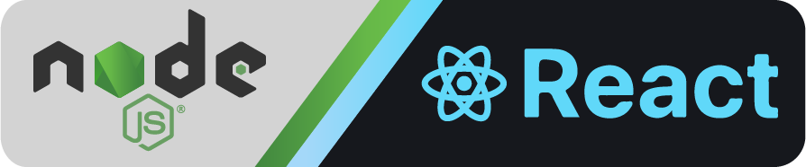
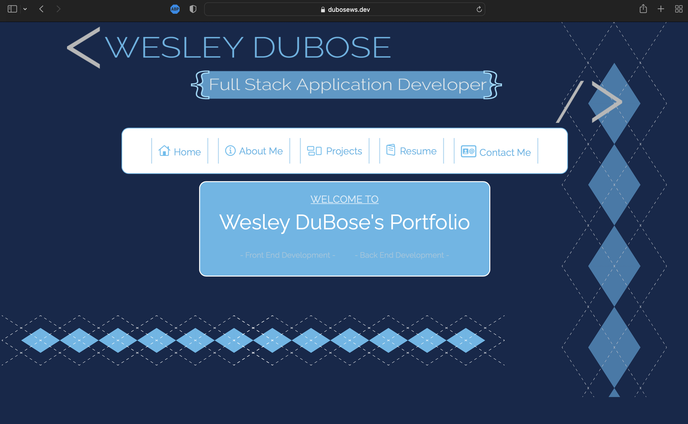

<div style="display: flex; flex-direction: row; justify-content: center; align-items: center; margin-top: 20px; margin-bottom: 20px;">
</img>
<div style="display: inline">

# Wesley DuBose's Development Portfolio <br>
Developed by: Wesley S. DuBose<br>
Framework: React.js
</div>
</div><br>


## Deployment
<a href="https://dubosews.dev" style="display: flex; justify-content: center;">
  <br></a><br><br>

## Live-Application

### https://dubosews.dev/ 
<br>

## Table of Contents
  1. [Deployment](#deployment)
  2. [Live-Application](#live-application)
  3. [Description](#description) 
  4. [Installation](#installation)
  5. [Usage](#usage)  
  6. [Contributing](#contributing)
  7. [Tests](#tests)
  8. [License](#license)
  9. [Questions](#questions)
  10. [E-mail](#e-mail)
<br><br>

## Description
This is the source code for Wesley DuBose's professional development portfolio. This entire application was developed using React.js. Included in this application is a solid framework that runs smoothly, as well as dynamic styling that includes animations, transitions and more. My resume and certificates are presented in this application using the Adobe PDF Embed API, this API's code is tied to my deployed application, so to view it locally you need to generate a new API on Adobe's website. 
```Also included in this application are all of the files that were used in the process of developing this application, including Adobe Illustrator files for icons, Adobe Photoshop files for icons, sample code bits and more.```

## Installation
This application was developed using React.js so to install this application, after cloning this repository to your computer, navigate to the directory in your command line. Using the command line in the application's root directory, enter the command ```npm i``` to initialize the node install protocal and download all the dependency files for the application.

## Usage
After following the steps above to install the application, navigate to this applications directory in the command line and run the command ```npm i``` to make sure that all the node modules and dependency packages are installed and updated. After making sure all the packages are up to date, navigate the command line to the applications root directory again and enter the command ```npm start```. This command will initialize the application and if everything is working, the application will continue to run in that terminal window until the command ```ctrl + c``` is used to terminate the active process, or close the terminal window to terminate as well.

## Contributing
This Application is not currently open to contributions, feel free to leave suggestions and/ or comments if you would like to. 

## Tests
There are no tests designed for this application.

## License


## Questions
<div style="display: flex; flex-direction: row; align-items: center;">
  </img>
  Github Profile: <a href="https://github.com/dubosews">dubosews https://github.com/dubosews</a>
</div><br>


<div style="display: flex; flex-direction: row; align-items: center;">
  </img>
  Contact Email: <a href="mailto:wsd10205@gmail.com">wsd10205@gmail.com</a><br><br>
</div><br>


### Directions for reaching out with further questions:
    Feel free to reach out to me with questions, comments, suggestions or job offers. I put a lot of work into making this application look and run well, so I hope you enjoy it! Thank you for Checking out my Professional Development Portfolio. Please do not reach out to me for solicitation or scams. 
